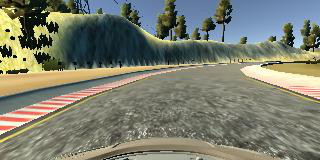

#**Behavioral Cloning** 

##Writeup Template

###You can use this file as a template for your writeup if you want to submit it as a markdown file, but feel free to use some other method and submit a pdf if you prefer.

---

**Behavioral Cloning Project**

The goals / steps of this project are the following:
* Use the simulator to collect data of good driving behavior
* Build, a convolution neural network in Keras that predicts steering angles from images
* Train and validate the model with a training and validation set
* Test that the model successfully drives around track one without leaving the road
* Summarize the results with a written report


## Rubric Points
###Here I will consider the [rubric points](https://review.udacity.com/#!/rubrics/432/view) individually and describe how I addressed each point in my implementation.  

---
###Files Submitted & Code Quality

####1. Submission includes all required files and can be used to run the simulator in autonomous mode

My project includes the following files:
* model.py containing the script to create and train the model
* drive.py for driving the car in autonomous mode
* model.h5 containing a trained convolution neural network 
* writeup_report.md or writeup_report.pdf summarizing the results

####2. Submission includes functional code
Using the Udacity provided simulator and my drive.py file, the car can be driven autonomously around the track by executing 
```sh
python drive.py model.h5
```

####3. Submission code is usable and readable

The model.py file contains the code for training and saving the convolution neural network. The file shows the pipeline I used for training and validating the model, and it contains comments to explain how the code works.

###Model Architecture and Training Strategy

####1. An appropriate model architecture has been employed

My model consists of a convolution neural network with 3 convolutional layers of 5x5 filter size and 2 layers of 3x3 filter size,  with depths between 24 and 64 (model.py lines 67-74) 

The model includes RELU layers to introduce nonlinearity (code lines 67-74), and the data is normalized in the model using a Keras lambda layer (code line 66). 

####2. Attempts to reduce overfitting in the model

The model contains dropout layers in order to reduce overfitting (model.py lines 71,77). 

The model was trained and validated on different data sets to ensure that the model was not overfitting (code line 61-62). The model was tested by running it through the simulator and ensuring that the vehicle could stay on the track.

####3. Model parameter tuning

The model used an adam optimizer, so the learning rate was not tuned manually (model.py line 84).

####4. Appropriate training data

Training data was chosen to keep the vehicle driving on the road. I used a combination of center lane driving, recovering from the left and right sides of the road with the steering correction of 0.2, positive for left camera image and negative for the right (code lines 40-45).
I have also augmented the images to overcome the left turn bias by flipping images and taking the opposite sign of the steering measurement (code lines 47-52).

For details about how I created the training data, see the next section. 

###Model Architecture and Training Strategy

####1. Solution Design Approach

The overall strategy for deriving a model architecture was to ...

My first step was to use a convolution neural network model similar to the NVIDIA Architecture. I thought this model might be appropriate because firstly it involves multiple convolutions which itself improves the model, followed by four fully connected layers, plus it also involves normalization at the start, it all seems to give a perfect picture for the situation. Plus NVIDIA used this model to drive the real autonomous vehicle on roads, which again adds to its promising nature.

In order to gauge how well the model was working, I split my image and steering angle data into a training and validation set. I found that my first model had a low mean squared error on the training set but a high mean squared error on the validation set. This implied that the model was overfitting. 

To combat the overfitting, I modified the model by including dropout layers with keep probability
of 0.75.

Then I checked with the epoch size of 7, but the validation score was flickering though in total was tending to reduce, hence i reduced the epochs to 3. 

The final step was to run the simulator to see how well the car was driving around track one. There were a few spots where the vehicle fell off the track like the sharp turn after the bridge, the car tends to go to the ground/field. To improve the driving behavior in these cases, I collected more data specifically for these conditions, including the case where by mistake the car goes to the field, then how to recover from the condition.

At the end of the process, the vehicle is able to drive autonomously around the track without leaving the road.

####2. Final Model Architecture

The final model architecture (model.py lines 65-80) consisted of a convolution neural network with the following layers and layer sizes,
##### Normalization Layer
##### Cropping Image
##### Convolution Layer with filter size 5x5 and filter number 24
##### Polling Layer of size 2x2
##### Relu Activation
##### Convolution Layer with filter size 5x5 and filter number 36
##### Polling Layer of size 2x2
##### Relu Activation
##### Dropout with Keep probability 0.75
##### Convolution Layer with filter size 5x5 and filter number 48
##### Polling Layer of size 2x2
##### Relu Activation
##### Convolution Layer with filter size 3x3 and filter number 64
##### Relu Activation
##### Dropout with Keep probability 0.75
##### Convolution Layer with filter size 3x3 and filter number 64
##### Relu Activation
##### Flatten Layer
##### Fully Connected Layer with size 100
##### Fully Connected Layer with size 50
##### Dropout with Keep probability 0.75
##### Fully Connected Layer with size 10
##### Fully Connected Layer with size 1

Here is a visualization of the architecture (note: visualizing the architecture is optional according to the project rubric)

![alt text][image1]

####3. Creation of the Training Set & Training Process

To capture good driving behavior, I first recorded two laps on track one using center lane driving. Here is an example image of center lane driving:

[center lane driving](https://github.com/aman-ahluwalia/CarND-Behavioral-Cloning/blob/master/examples/straight_center_image.jpg)
<div></div>

I then travelled the same path 2 times again but in opposite direction, to remove the anticlockwise bias in the track.

[reverse center lane driving](https://github.com/aman-ahluwalia/CarND-Behavioral-Cloning/blob/master/examples/reverse_center_image.jpg)
<div></div>

I then recorded the vehicle recovering from the left side and right sides of the road back to center so that the vehicle would learn to recorver from misplaced position. These images show what a recovery looks like starting from corner with dirt, from the bridge corner, from the farm after the bridge. :

[corner dust right recovering](https://github.com/aman-ahluwalia/CarND-Behavioral-Cloning/blob/master/examples/corner_dust_rigth.jpg)
<div></div>

[corner bridge left recovering](https://github.com/aman-ahluwalia/CarND-Behavioral-Cloning/blob/master/examples/corner_bridge_left.jpg)
<div></div>

[corner right farm recovering](https://github.com/aman-ahluwalia/CarND-Behavioral-Cloning/blob/master/examples/corner_right_farm.jpg)
<div></div>


Then I repeated this process on track two in order to get more data points.

To augment the data sat, I also flipped images and angles thinking that this would ... For example, here is an image that has then been flipped:

[Image captured by the center camera](https://github.com/aman-ahluwalia/CarND-Behavioral-Cloning/blob/master/examples/center_normal.jpg)
<div></div>

[Flipped image from the center camera](https://github.com/aman-ahluwalia/CarND-Behavioral-Cloning/blob/master/examples/center_flipped.jpg)
<div></div>


After the collection process, I had 2880 number of data points.


I finally randomly shuffled the data set and put 20% of the data into a validation set. 

I used this training data for training the model. The validation set helped determine if the model was over or under fitting. The ideal number of epochs was 5 as evidenced by the resultant loss graph(shown below) I used an adam optimizer so that manually training the learning rate wasn't necessary.

[Loss Graph](https://github.com/aman-ahluwalia/CarND-Behavioral-Cloning/blob/master/examples/Figure_1.jpg)
<div></div>
